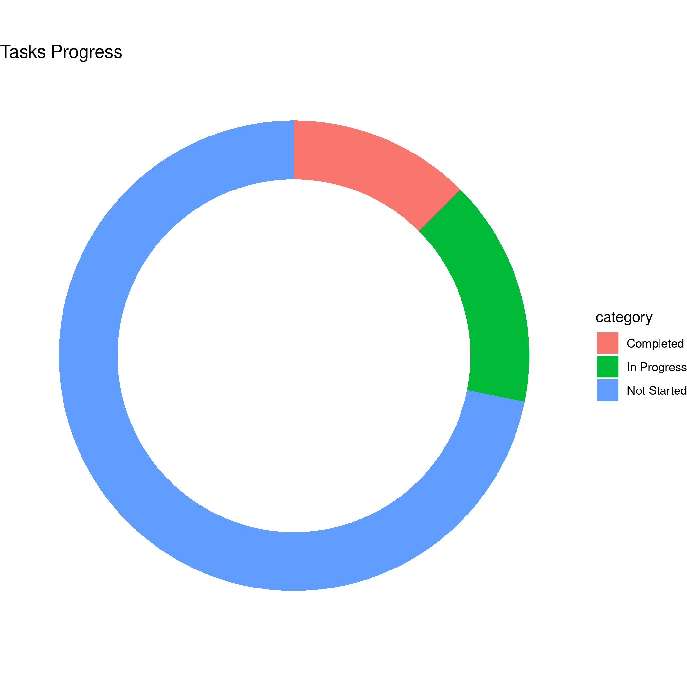

# plannr <a href="https://plannr.justinsingh.me"></a>

[](https://travis-ci.org/program--/plannr)
[](https://codecov.io/gh/program--/plannr?branch=master)
[](https://www.repostatus.org/#active)

**plannr** is an in-development package used for parsing **Microsoft Planner** data into R via
exported *Excel* spreadsheets for easy usage and creation of beautiful **ggplot2** or **plotly** visuals.

Usage of plannr is fairly simple:

1. Open your planner in the Microsoft Planner web application.
2. Export plan to Excel (as `.xlsx`).
3. Read using plannr's `read_planner()` function.

Now you have your Planner data imported into **R** as a `plannr` object!

## Installation
To install the developmental version:

```r
remotes::install_github("program--/plannr")
```

## Plotting with plannr
Using the `plot_planner()` function, you can quickly create a **donut chart** using `ggplot` or `plotly` to your specifications. `plot_planner()` supports filtering by:

- `tasks` - Tasks (w/o Checklists)
- `checklists` - Tasks (w/ Checklists)
- `priority` - Priority
- `late` - Late Tasks
- `assigned_to` - Assigned To
- `completed_by` - Completed By

### Examples:

**Plannr Object Summary**

```r
plan_xlsx <- read_planner("path/to/planner.xlsx")

summary(plan_xlsx)

# Return:
# =======>> PLANNER <<=======
#    Plan Name: Example Plan
#  Export Date: 01/01/1234
# ========>> TASKS <<========
#       Total: 32 Tasks
#   Completed: 4    (12.50%)
# In Progress: 5    (15.62%)
# Not Started: 23   (71.88%)
# ===>> CHECKLIST TASKS <<===
#       Total: 57 Tasks
#   Completed: 0    (0.00%)
# Not Started: 57   (100.00%)
# ===========================
```

**Basic Plotting**

```r
# Print a donut plot taking into account checklists on tasks
plan_xlsx <- read_planner("path/to/planner.xlsx")

plot_planner(plan_xlsx, by = "checklists")
```



**Getting *filtered* plot data**

```r
# Return a easy-plottable-tibble of the planner data filtered by priority
plot_planner(plan_xlsx, by = "priority", data_only = TRUE)
```

**Extending with `ggplot`**

```r
# Easy customizability via `plot_type = "basic"` argument.
# Which, returns a ggplot() object of the planner data without
# anything additional.
#
# labs() parameters can be added to the end of the argument list
# for plot_planner() calls.
plot_planner(
    plan_xlsx,
    by = "tasks",
    plot_type = "basic",
    title = "Tasks Progress"
) +
geom_bar() +
theme_bw() +
theme(
    legend.position = "none"
)
```

**Interactive plots with `plotly`**

```r
plot_planner(
    plan_xlsx,
    by = "checklists",
    interactive = TRUE
)
```

## Using `dplyr` with Planner data

Currently there's two supported ways of using `dplyr` functions via plannr.

1. Using `filter_planner()` for `dplyr::filter()`.
2. Using `plot_planner(..., data_only = TRUE, ...)` with `magrittr` piping.

## Documentation

You can view the documentation here: [https://plannr.justinsingh.me](https://plannr.justinsingh.me).
